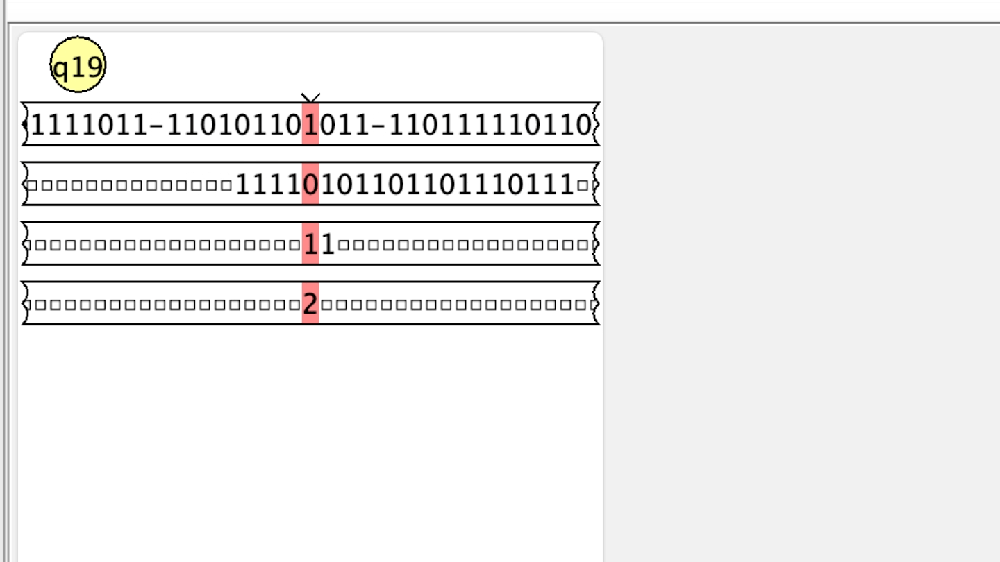

# UniversalTuringMachine

Implementazione della mdtU in Python e JFlap

Per definizione una macchina di Turing è una settupla M = (Q, Σ, Γ, δ, q0, qaccept, qreject).

Analizziamo un caso di una macchina di turing che accetta il linguaggio L = {a^n b^n c^n | n > 0 }
Formalmente:
- Q = {Q0, Q1, Q2, Q3, Q4, Q5, Q6}
- Σ = {a, b, c, A, B, C}
- Γ = {□, a, b, c, A, B, C}
- δ(Q0,A) = (Q0,A,R)
- δ(Q0,a) = (Q1,A,R)
- δ(Q1,a) = (Q1,a,R)
- δ(Q1,B) = (Q1,B,R)
- δ(Q1,b) = (Q2,B,R)
- δ(Q2,b) = (Q2,b,R)
- δ(Q2,C) = (Q2,C,R)
- δ(Q2,c) = (Q3,C,R)
- δ(Q3,c) = (Q3,c,R)
- δ(Q3,C) = (Q3,C,R)
- δ(Q3,□) = (Q4,□,L)
- δ(Q4,A) = (Q4,A,L)
- δ(Q4,B) = (Q4,B,L)
- δ(Q4,C) = (Q4,C,L)
- δ(Q4,□) = (Q5,□,S)
- δ(Q4,c) = (Q6,c,L)
- δ(Q4,b) = (Q6,b,L)
- δ(Q4,a) = (Q6,a,L)
- δ(Q6,a) = (Q6,a,L)
- δ(Q6,b) = (Q6,b,L)
- δ(Q6,c) = (Q6,c,L)
- δ(Q6,A) = (Q6,A,L)
- δ(Q6,B) = (Q6,B,L)
- δ(Q6,C) = (Q6,C,L)
- δ(Q6,□) = (Q0,□,R)
- Q5
- Q0, Q1, Q2, Q3, Q4, Q6

1. Codifico l'alfabeto
   a -> 1
   b -> 11
   c -> 111
   A -> 1111
   B -> 11111
   C -> 111111
   □ -> $

2. Codifico movimenti
   L -> 1
   R -> 11
   S -> 111

3. Codifico stati:
   Q0 -> 1
   Q1 -> 11
   Q2 -> 111
   Q3 -> 1111
   Q4 -> 11111
   Q5 -> 2
   Q6 -> 1111111

4. Codifico tutte le transizioni:
	(1011110101111011-10101101111011-110101101011-11011111011011111011-110110111011111011-1110110111011011-111011111101110111111011-1110111011110111111011-11110111011110111011-11110111111011110111111011-11110$0111110$01-11111011110111110111101-1111101111101111101111101-111110111111011111011111101-111110$020$0111-11111011101111111011101-111110110111111101101-1111101011111110101-111111101011111110101-11111110110111111101101-1111111011101111111011101-111111101111011111110111101-11111110111110111111101111101-1111111011111101111111011111101-11111110$010$011)

Input JFLAP: (1011110101111011-10101101111011-110101101011-11011111011011111011-110110111011111011-1110110111011011-111011111101110111111011-1110111011110111111011-11110111011110111011-11110111111011110111111011-11110$0111110$01-11111011110111110111101-1111101111101111101111101-111110111111011111011111101-111110$020$0111-11111011101111111011101-111110110111111101101-1111101011111110101-111111101011111110101-11111110110111111101101-1111111011101111111011101-111111101111011111110111101-11111110111110111111101111101-1111111011111101111111011111101-11111110$010$011)10101101101110111
Input Python: (1011110101111011-10101101111011-110101101011-11011111011011111011-110110111011111011-1110110111011011-111011111101110111111011-1110111011110111111011-11110111011110111011-11110111111011110111111011-11110$0111110$01-11111011110111110111101-1111101111101111101111101-111110111111011111011111101-111110$020$0111-11111011101111111011101-111110110111111101101-1111101011111110101-111111101011111110101-11111110110111111101101-1111111011101111111011101-111111101111011111110111101-11111110111110111111101111101-1111111011111101111111011111101-11111110$010$011)
              10101101101110111 -> aabbcc
              
La Macchina di Turing Universale è costituita da 4 nastri:
- N1: nastro contenente le configurazioni
- N2: nastro contenente l'input
- N3: nastro contenente lo stato corrente
- N4: nastro contenente lo stato finale (Evitabile)

Per poter funzionare bisogna:
- Parentesi tonde all'inizio e alla fine delle transizioni codificate
- La prima transizione deve partire dallo stato iniziale
- Il carattere $ è il blank
- Il carattere 2 rapprensenta l'unico stato finale
- In JFlap la codifica delle transizioni e l'input devono essere inseriti in input nel primo nastro, sono separati dalla parentesi tonda chiusa
